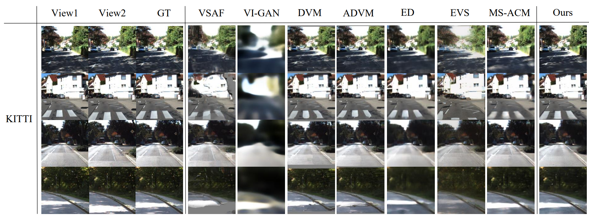

# SCGN

Implementation of SCGN in paper *"[Deep View Synthesis via Self-Consistent Generative Networks](https://ieeexplore.ieee.org/abstract/document/9339999)"* [[arxiv](https://arxiv.org/abs/2101.10844)].

We propose a novel end-to-end deep generative model, called self-consistent generative network (SCGN),  to synthesize novel views from given input views relying on image content only.

<p align="center"></p>
<p align="center"></p>

## Requirements
- Python == 3.x
- OpenCV-Python
- Tensorflow >= 1.12
- Platform: Linux

## Usage
### 1. Clone
```shell
git clone https://github.com/zhuomanliu/SCGN.git
cd SCGN/
```

### 2. Data Preparation
#### 2.1. Multi-PIE
- Download dataset from [here](http://www.cs.cmu.edu/afs/cs/project/PIE/MultiPie/Multi-Pie/Home.html).
- According to the [Content](http://www.cs.cmu.edu/afs/cs/project/PIE/MultiPie/Multi-Pie/Content.html) page, we collect data from varied poses (take *05_1* as the target pose) with the highest illumination (*i.e.*, the 7th illumination). 
- Specifically, the original image would be center-cropped and resized into 224x224.
    
#### 2.2. KITTI
- Download the [odometry data (color)](http://www.cvlibs.net/download.php?file=data_odometry_color.zip) from [here](http://www.cvlibs.net/datasets/kitti/eval_odometry.php).
- Collect the first 11 sequences from */dataset/sequences/${seq_id}/image_2/*, where *seq_id* is from 00 to 10, and place the sequences in the folder *./datasets/kitti/data*. Similarly, the raw image would be center-cropped and resized into 224x224.
- Execute *./datasets/kitti/gen_list.py* for train-test split and random sampling, then *train.csv* and *test.csv* will be generated in *./datasets/kitti/split*.
- Alternatively, we also provide the prepared KITTI dataset. [[Google Drive](https://drive.google.com/drive/folders/1ntRnAmLVJIRhjTqj8l9mOER3Rb7jKJXo?usp=sharing)] [[Baidu Cloud](https://pan.baidu.com/s/1366JQoXlw1OtnjEJproIUQ), pwd: 57gq]

### 3. Train & Test
- Download pre-trained models [[Multi-PIE](https://drive.google.com/file/d/1H66gNGDLqD-EC4EfyG7pIG-Mdl2P6Sol/view?usp=sharing), [KITTI](https://drive.google.com/file/d/1HGjNcMHJNuld6fa1hW4wx7erix1BU9wg/view?usp=sharing)] and unzip them in the folder *./ckpts* for testing.
- Start training or testing as follows:

```shell
# train
./train.sh 0 multipie run-multipie  # for Multi-PIE
./train.sh 0 kitti run-kitti  # for KITTI

# test
./test.sh 0 multipie run-multipie res-multipie  # for Multi-PIE 
./test.sh 0 kitti run-kitti res-kitti  # for KITTI
```

### 4. Demo
- We have provided some samples in *./demo/multipie* and *./demo/kitti* for inference.
- Start inference as follows:
```shell
# for Multi-PIE
./demo.sh 0 multipie run-multipie ./demo/multipie 15_input_l.png 15_input_r.png 15_result
./demo.sh 0 multipie run-multipie ./demo/multipie 30_input_l.png 30_input_r.png 30_result
./demo.sh 0 multipie run-multipie ./demo/multipie 45_input_l.png 45_input_r.png 45_result

# for KITTI
./demo.sh 0 kitti run-kitti ./demo/kitti 09_input_l.png 09_input_r.png 09_result
./demo.sh 0 kitti run-kitti ./demo/kitti 10_input_l.png 10_input_r.png 10_result
```

## Citation
Please cite the following paper if this repository helps your research:
<pre><code> 
@article{liu2021deep,
  title={Deep View Synthesis via Self-Consistent Generative Network},
  author={Liu, Zhuoman and Jia, Wei and Yang, Ming and Luo, Peiyao and Guo, Yong and Tan, Mingkui},
  journal={IEEE Transactions on Multimedia},
  year={2021},
  publisher={IEEE}
}
</pre></code>
